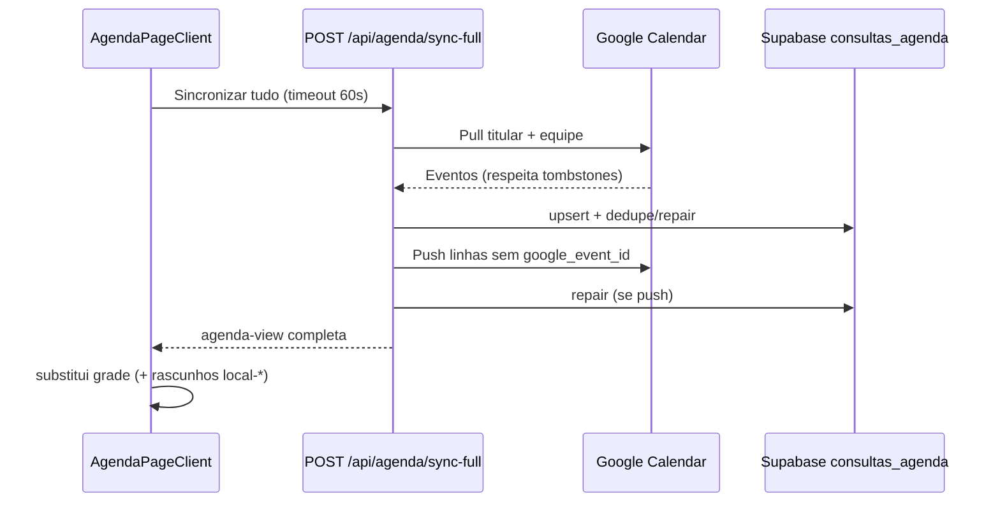

# Sincronização da Agenda (Turquesa ↔ Google)

Documentação do fluxo de sync após **Fase 3** (`POST /api/agenda/sync-full`).

## Visão geral



**Fonte de verdade na grade:** `GET /api/consultas/agenda-view` (e resposta do sync-full).

**localStorage:** write-only (cache offline); **não** entra no merge do botão Sincronizar.

## Fases entregues

| Fase | Entrega |
|------|---------|
| 0 | Auditoria — `docs/AGENDA_SYNC_AUDIT.md` |
| 1 | `agenda-view`, mount sem cache primeiro, índice UNIQUE `google_event_id` |
| 2 | Ícones `sync_health` + filtros Turquesa/Google |
| 3 | **sync-full servidor** — este documento |
| 4 | WhatsApp no modal da agenda |
| 5 | LWW horário (patch-time, conflito) |
| 6 | Hardening: logs estruturados, admin sync_health, `docs/AGENDA_SYNC_TEST.md` |

## POST `/api/agenda/sync-full`

Autenticação: `requireVerifiedOwner`. `maxDuration`: 60s (Vercel).

**Observabilidade (Fase 6):** cada execução emite log JSON em `[agenda/sync-full]` com `google_imported`, `deduped_deleted`, `deduped_migrated`, `google_pushed`, `google_push_skipped`, `google_pull_errors`, `google_push_errors`, `consultas_count`, `duration_ms`.

### Passos (idempotentes)

1. **Pull Google** — `syncConsultasAgendaFromGoogleCalendars(owner, { paginate, janela agenda })`
   - Titular + profissionais com agenda conectada
   - Ignora `google_event_id` em `consultas_agenda_excluidos` (tombstone)
   - Upsert em `consultas_agenda`

2. **Reconcile / repair** — `repairConsultasAgendaForOwner(owner)`
   - Dedupe por `google_event_id` e slot (`owner`, `medico`, `inicio` ±1 min)
   - Promove IDs legados para UUID

3. **Push Turquesa → Google** — `pushPendingConsultasToGoogleCalendars(owner)`
   - Linhas sem `google_event_id` na janela da agenda
   - Payload: `buildProfessionalGoogleEventPayload` + `enrichProfessionalCalendarEvent`
   - Atualiza `google_event_id` no Supabase (condição `IS NULL` — idempotente)
   - Limite: 40 pushes por execução (evita timeout)

4. **Repair opcional** — se houve push com sucesso

5. **Resposta** — `buildAgendaViewForOwner` com `sync_health` calculado

### Resposta JSON

```json
{
  "success": true,
  "googleImported": 12,
  "repaired": { "deleted": 2, "migrated": 0 },
  "googlePushed": 1,
  "googlePushSkipped": 3,
  "googlePushErrors": [],
  "googlePullErrors": [],
  "consultas": [ /* agenda-view */ ]
}
```

Checklist E2E manual: `docs/AGENDA_SYNC_TEST.md`.

## Cliente (`AgendaPageClient`)

- Botão **Sincronizar tudo** → `syncAgendaFullFromServer()` (timeout **60s**)
- Substitui `events` com resposta; preserva apenas rascunhos `local-*` em memória
- **Não** chama `mergeGoogleCalendarEvents` nem `handleGoogleSync` no botão principal
- **Importar do Google** — mesmo fluxo sync-full (atalho na sidebar)
- Polling (`consultasRevisionPoll`) — refetch `agenda-view`, sem merge localStorage

### Timeout no cliente

Mensagem: *"A sincronização demorou mais de 60 segundos. Tente de novo com Wi‑Fi estável."*

## Tombstones

Tabela `consultas_agenda_excluidos`: exclusões não são reimportadas do Google.

Implementado em `syncConsultasAgendaFromGoogleCalendars` via `loadExcludedGoogleEventIds`.

## Arquivos principais

| Arquivo | Função |
|---------|--------|
| `lib/agendaSyncFull.ts` | Orquestração sync-full |
| `lib/syncConsultasFromGoogleServer.ts` | Pull Google → Supabase |
| `lib/agendaTimeLww.ts` | LWW horário + detecção de conflito (<5 min) |
| `lib/pushConsultasToGoogleServer.ts` | Push Supabase → Google (+ `pushConsultaTimeToGoogle`) |
| `app/api/consultas/patch-time/route.ts` | PATCH horário (Supabase → fila Google) |
| `app/api/consultas/resolve-time-conflict/route.ts` | Resolução manual de conflito |
| `components/AgendaTimeConflictModal.tsx` | Modal "Google Xh / Turquesa Yh" |
| `lib/agendaViewServer.ts` | Montagem agenda-view |
| `app/api/agenda/sync-full/route.ts` | API |
| `lib/syncConsultasClient.ts` | `syncAgendaFullFromServer`, `refetchAgendaViewAuthoritative` |
| `lib/consultasRevisionPoll.ts` | Poll sem merge local |

## O que **não** está nesta fase

- Lembretes WhatsApp / Dashboard atrasados (Fase 4)

## Fase 5 — LWW de horário

- **Arrastar na grade:** `PATCH /api/consultas/patch-time` → Supabase (`inicio`/`fim`/`updated_at`) → push Google em background (`queuePushConsultaTimeToGoogle`).
- **sync-full / pull Google:** compara `google.updated` vs `updated_at`; Google mais recente atualiza Supabase; edições simultâneas (&lt;5 min) → `sync_health = needs_review`.
- **Modal:** `AgendaTimeConflictModal` — "Google: 15h / Turquesa: 14h — manter qual?"; resolve via `POST /api/consultas/resolve-time-conflict`.
- **SQL:** `npm run db:consultas-sync-phase5` — colunas `sync_health`, `google_updated_at`, `conflict_google_*`; UNIQUE `google_event_id` idempotente.

## O que **não** está nesta fase (pós-Fase 5)

- Security review + docs teste (Fase 6)

## Teste manual (conta salão + Google)

1. Desktop: criar sessão só Turquesa → **Sincronizar tudo** → aparece no Google
2. Mobile: mesmo botão → mesma grade (sem duplicata)
3. Excluir no desktop → mobile após poll/sync → some
4. Importar evento Google sem cliente → ícone vermelho (Fase 2)
5. Excluir evento → não volta após sync-full (tombstone)
