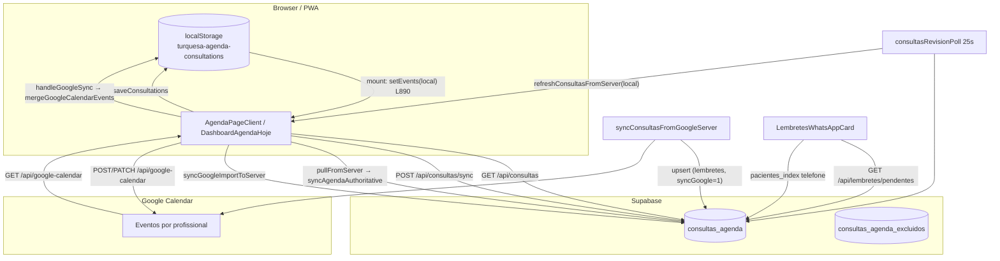

# Auditoria — Agenda e sincronização (Fase 0)

**Produto:** Turquesa Agenda (salão PT-BR)  
**Repo:** `e:/Documents/turquesaagenda`  
**Estado do código auditado:** `master` @ `ec8f9da` (revert de `ce959f5`; hotfix `0594ed4` ativo)  
**Data:** 2026-06-26  
**Escopo:** somente leitura — nenhuma alteração de produção nesta fase.

---

## 1. Fontes de verdade hoje

Hoje existem **três camadas** que disputam a mesma grade, sem um único dono no cliente:

| Camada | Chave / tabela | Quem escreve | Quem lê na UI |
|--------|----------------|--------------|---------------|
| **localStorage** | `turquesa-agenda-consultations:{email}` | `saveConsultations` em vários fluxos | **Primeiro** ao abrir Agenda (`AgendaPageClient`) |
| **Supabase** | `consultas_agenda` | API `/api/consultas/sync`, upserts server, import Google server | Merge via `loadAndMergeConsultasFromServer` |
| **Google Calendar** | `google_event_id` | POST/PATCH `/api/google-calendar`, import | `handleGoogleSync` → merge no browser |

Tombstones de exclusão: `consultas_agenda_excluidos` + `deleted_at` em `consultas_agenda` (quando coluna existe).

### Diagrama de fluxo (estado atual)



### Caminhos principais mapeados

#### `components/AgendaPageClient.tsx`

| Ação | Leitura | Escrita |
|------|---------|---------|
| Mount `useEffect` L887–934 | `loadConsultations` → **mostra cache imediato** L890–891 | `loadAndMergeConsultasFromServer` → `saveConsultations` L897–903 |
| `storage` / `medsupapp-consultations-updated` L919–926 | `loadConsultations` **sem dedupe servidor** | `setEvents` |
| `pullFromServer` L947–964 | `syncAgendaAuthoritative` | `saveConsultations` |
| `handleGoogleSync` L1158–1259 | `loadConsultations` L1195 | `mergeGoogleCalendarEvents` → `saveConsultations` → `syncGoogleImportToServer` |
| `refreshAgendaData` L1262–1281 | pull + Google (só desktop) | mensagem UI |
| Polling revisão L1350+ | `refreshConsultasFromServer(local)` | `saveConsultations` |
| CRUD modal / delete | estado React + `saveConsultations` | Supabase imediato ou background |

#### `components/DashboardAgendaHoje.tsx`

| Ação | Leitura | Escrita |
|------|---------|---------|
| `applyLocal` L61–66 | `loadConsultations` | `setEvents` |
| `syncRemote` L68–100 | `loadAndMergeConsultasFromServer(local)` | `saveConsultations` se diff |

**Risco:** Dashboard “hoje” pode divergir da Agenda se caches diferirem.

#### `components/LembretesWhatsAppCard.tsx`

| Ação | Leitura | Escrita |
|------|---------|---------|
| `GET /api/lembretes/pendentes` | `consultas_agenda` por dia alvo + `pacientes_index` | nenhuma na lista |
| `marcar-enviado` / `marcar-removido` | — | `whatsapp_lembrete_enviado` |

Não usa `localStorage` — fonte é **só Supabase** + índice de telefones.

#### `lib/syncConsultasClient.ts`

| Função | Papel |
|--------|--------|
| `mergeGoogleCalendarEvents` L281+ | Mescla Google no array local; pode `push` evento novo |
| `mergeServerPullWithLocal` L596+ | Supabase base + pending `local-*` / Google import |
| `loadAndMergeConsultasFromServer` L659+ | GET `/api/consultas` + merge + push pendentes |
| `syncAgendaAuthoritative` (via `syncAllModulesClient`) | flush pendentes + pull com **local completo** |
| `dedupeConsultations` L221+ | ±1 min + profissional; não une se slot não casa |
| `scheduleSyncConsultasToServer` | debounce push pendentes |

#### `lib/syncAllModulesClient.ts`

- `syncAgendaAuthoritative` L56+: `flushLocalConsultasToServer` → `pullConsultasAuthoritativeFromServer(loadConsultations())` — ainda passa **cache local inteiro** no pull.

#### `lib/syncConsultasFromGoogleServer.ts`

- `syncConsultasAgendaFromGoogleCalendars`: fetch Google API server-side → upsert `consultas_agenda` (usado em lembretes com `?syncGoogle=1`).

#### `lib/consultations.ts`

- `loadConsultations` / `saveConsultations` L461+ / L528+
- `consultationsStorageKey` por e-mail; migração legada L453–458
- `clearConsultationsStorage` no logout (`Header.tsx`)

#### `lib/consultasAgenda.ts`

- CRUD Supabase, soft delete, `repairConsultasAgendaForOwner` L732+
- `queryConsultasAgendaForDay` L802+ (lembretes: `lembretes_whatsapp=true`, status agendado/confirmado)

---

## 2. Bugs e riscos conhecidos (com referência)

| ID | Severidade | Sintoma | Causa provável | Arquivo:linha |
|----|------------|---------|----------------|---------------|
| B1 | P0 | Duplicata mesmo horário no mobile | Cache local mostrado antes do merge; `handleGoogleSync` relê `loadConsultations` | `AgendaPageClient.tsx:890-891`, `1195-1196` |
| B2 | P0 | Duplicata após “Sincronizar” | `mergeGoogleCalendarEvents` + `syncGoogleImportToServer` sobem cópias | `syncConsultasClient.ts:281-312`, `AgendaPageClient.tsx:1194-1202` |
| B3 | P0 | Agendamento “sumiu” (revert ce959f5) | Mount autoritativo ignorou órfãos locais sem estar no Supabase | *revertido* — risco se repetir Fase 1 sem `agenda-view` |
| B4 | P1 | Desktop ≠ mobile | `refreshAgendaData` não chama Google no mobile | `AgendaPageClient.tsx:1267-1268` |
| B5 | P1 | Listener storage reaplica cache cru | `handler` L919-926 sem `refreshConsultasFromServer` | `AgendaPageClient.tsx:919-926` |
| B6 | P1 | Dashboard ≠ Agenda | `DashboardAgendaHoje` usa merge próprio com local primeiro | `DashboardAgendaHoje.tsx:61-74` |
| B7 | P1 | Lembrete 7 dias não aparece | Só lista consultas no dia **exato** `hoje + N dias` | `lembretesPendentes.ts:193-204` |
| B8 | P1 | Cliente vinculada tarde sem lembrete | Sem telefone/`cliente_drive_id` na linha na data do lembrete | `lembretesPendentes.ts:107-124` |
| B9 | P2 | Modal sem “7 dias antes” | API não permite `lembrete_7_dias` | `mensagem-whatsapp/route.ts:15-18`, `AgendaConsultaModal.tsx:177-186` |
| B10 | P2 | Dedupe falha | `sameAppointmentSlot` ±1 min; médico vazio vs preenchido | `syncConsultasClient.ts:81-89` |
| B11 | P2 | UUID órfão no Supabase | Sem UNIQUE `(owner_email, google_event_id)` | schema atual |
| B12 | P2 | Polling merge local | `consultasRevisionPoll` parte de `loadConsultations` | `consultasRevisionPoll.ts:42-45` |
| B13 | P2 | Erros engolidos | mount/pull `catch { /* best-effort */ }` | `AgendaPageClient.tsx:908-909`, `947-960` |
| B14 | P3 | Pacote ce959f5 quebrou Dashboard | Lembretes “atrasados” sem validação + mount agressivo | revert `ec8f9da` |

### Hotfixes ainda ativos (`0594ed4`)

- Mobile: Sincronizar sem Google automático (`AgendaPageClient.tsx:1264-1268`)
- `fetchWithTimeout` no Google (`lib/fetchWithTimeout.ts`)
- Agendar pelo perfil cliente: Google em background (`ClientesPageClient.tsx`)

---

## 3. Cenários de teste manual (10)

Conta tipo salão com Google (ex.: `marrissamartins@gmail.com`). Anotar: desktop, mobile PWA, Dashboard.

| # | Cenário | Passos | Resultado esperado (pós-roadmap) | Resultado aceitável hoje |
|---|---------|--------|--------------------------------|-------------------------|
| T1 | Mount limpo | Sair → Entrar → abrir Agenda sem tocar botões | Grade = Supabase = Google (±0) | Pode flash cache; converge em ~5–30 s |
| T2 | Cross-device | Desktop cria sessão → mobile abre Agenda | Mesma linha, 1 slot | Polling ou Sincronizar mobile |
| T3 | Duplicata mobile | Mobile com cache antigo → Sincronizar | Sem duplicar | **Falha conhecida** se não Sair antes |
| T4 | Google import | Importar do Google (desktop) | Stubs com `google_event_id` | Pode duplicar se cache sujo |
| T5 | Vincular cliente | Evento só nome → editar → vincular + WhatsApp + Salvar | `linked_ok` futuro; lembrete possível | Salvar; telefone na linha |
| T6 | Lembrete 7 dias | Sessão em exatamente N dias → Dashboard Lembretes | Aparece na lista | Só no dia exato; precisa telefone |
| T7 | Lembrete perdido | Sessão em 3 dias, nunca enviou 7 dias | Botão manual no modal (Fase 4) | **Não aparece** no Dashboard |
| T8 | Excluir | Excluir no desktop → mobile | Some em ambos | Tombstone + poll; pode atrasar |
| T9 | Trocar horário | Editar hora no modal → salvar | Uma linha; Google atualiza | Verificar Google manualmente |
| T10 | Perfil cliente | Agendar pela ficha cliente | Modal fecha; 1 linha no Supabase | OK pós-0594ed4 |

---

## 4. Proposta `sync_health` e SQL

### Enum lógico (calcular na API — sem migration obrigatória na Fase 1)

```typescript
type AgendaSyncHealth =
  | 'google_only'       // google_event_id presente; falta cliente ou telefone
  | 'turquesa_only'     // sem google_event_id
  | 'linked_partial'    // ambos mundos; falta cliente_drive_id OU telefone
  | 'linked_ok';        // google_event_id + cliente_drive_id + telefone válido
```

**Regras de cálculo (servidor):**

1. Resolver telefone: `consulta.telefone` → `pacientes_index` por `cliente_drive_id` → por nome (`lembretesPendentes.ts:66-84`).
2. `google_only`: tem `google_event_id` e não qualifica `linked_ok`.
3. `turquesa_only`: sem `google_event_id`.
4. `linked_ok`: `google_event_id` + `cliente_drive_id` + telefone válido.
5. `linked_partial`: demais casos com linha ativa.

**UI (Fase 2):** X vermelho / ✓ verde / ! amarelo / neutro.

### Constraints SQL recomendadas

Script sugerido: `sql/consultas_agenda_sync_phase1.sql` (gitignored + `npm run db:consultas-sync-phase1`).

```sql
-- 1) Um evento Google por owner
CREATE UNIQUE INDEX IF NOT EXISTS consultas_agenda_owner_google_event_uidx
  ON consultas_agenda (owner_email, google_event_id)
  WHERE google_event_id IS NOT NULL AND deleted_at IS NULL;

-- 2) Listagem por período (agenda-view)
CREATE INDEX IF NOT EXISTS consultas_agenda_owner_inicio_idx
  ON consultas_agenda (owner_email, inicio)
  WHERE deleted_at IS NULL;

-- 3) Opcional Fase 5: coluna persistida (só se relatórios precisarem)
-- ALTER TABLE consultas_agenda ADD COLUMN IF NOT EXISTS sync_health TEXT;
```

**Idempotência:** upsert por `google_event_id`; repair server-side após sync-full.

### API alvo (Fase 1 — não implementada nesta auditoria)

- `GET /api/consultas/agenda-view` — única leitura da grade; cliente **não** faz `setEvents(loadConsultations())` antes.
- `POST /api/agenda/sync-full` (Fase 3) — Google pull + reconcile + repair + push; retorna `agenda-view`.

---

## 5. Roadmap referenciado

| Fase | Entrega | Depende de |
|------|---------|------------|
| 0 | Este documento | — |
| 1 | `agenda-view` + mount sem cache primeiro | Fase 0 |
| 2 | Ícones + filtros `sync_health` | Fase 1 em produção validada |
| 3 | `sync-full` servidor | Fase 1 |
| 4 | `lembrete_7_dias` no modal apenas | Isolado |
| 5 | LWW horário + conflito | Fase 3 |
| 6 | Security review + docs teste | Fases 1–3 |

**Não repetir:** pacote único (ce959f5) com mount + lembretes atrasados + cache.

---

## 6. Arquivos de referência rápida

| Arquivo | Responsabilidade |
|---------|------------------|
| `components/AgendaPageClient.tsx` | UI agenda, sync, Google merge cliente |
| `components/DashboardAgendaHoje.tsx` | Resumo dia (local merge) |
| `components/LembretesWhatsAppCard.tsx` | Lembretes Dashboard |
| `components/AgendaConsultaModal.tsx` | CRUD + WhatsApp parcial |
| `lib/syncConsultasClient.ts` | Merge, dedupe, push/pull cliente |
| `lib/syncAllModulesClient.ts` | `syncAgendaAuthoritative` |
| `lib/syncConsultasFromGoogleServer.ts` | Import Google servidor |
| `lib/consultations.ts` | localStorage |
| `lib/consultasAgenda.ts` | Supabase CRUD + repair |
| `lib/lembretesPendentes.ts` | Quem aparece no Dashboard |
| `lib/consultasRevisionPoll.ts` | Poll 25s |
| `lib/consultasAgendaExcluidos.ts` | Tombstones Google |

---

*Fase 0 concluída — aguardando validação do usuário antes da Fase 1.*
