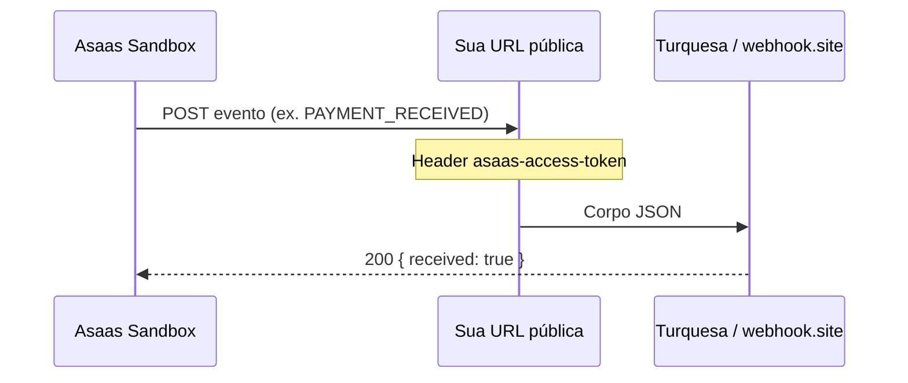

# Webhook Asaas — passo a passo

## Produção (www.turquesaagenda.com.br)

| Campo | Valor |
|-------|--------|
| URL | `https://www.turquesaagenda.com.br/api/webhooks/asaas` |
| Token | Mesmo valor de `ASAAS_WEBHOOK_TOKEN` na Vercel (header `asaas-access-token`) |
| Envio | **Sequencial** |
| Eventos | `PAYMENT_CREATED`, `PAYMENT_CONFIRMED`, `PAYMENT_RECEIVED`, `PAYMENT_OVERDUE` (+ cancelamento assinatura se usar) |

Teste após deploy:

```bash
npm run test:webhook:prod
curl -sS https://www.turquesaagenda.com.br/api/health/auth-config
```

Regras de liberação de acesso: [ASAAS_BILLING.md](./ASAAS_BILLING.md).

---

## Sandbox (desenvolvimento)

Guia para receber eventos no **Turquesa Agenda local** ou no **webhook.site** (mais rápido para só olhar o JSON).

Pré-requisitos: conta em **https://sandbox.asaas.com/**, chave API no `.env.local` (`ASAAS_API_KEY`), assinatura de teste (opcional: `npm run asaas:test:setup`).

---

## Visão geral



O Asaas **só envia** webhook para URL **HTTPS pública**. No PC use **ngrok** ou, para só inspecionar JSON, **webhook.site**.

---

## Parte A — Só ver o JSON (webhook.site, ~5 min)

Ideal para a primeira vez, sem rodar o Next.js.

### 1. Abrir webhook.site

1. Acesse **https://webhook.site**
2. Copie a URL única (ex.: `https://webhook.site/abc123-...`)

### 2. Criar webhook no Asaas sandbox

1. **https://sandbox.asaas.com/** → canto superior direito → **perfil** → **Integrações**
2. Aba ou botão **Webhooks** → **Criar webhook**
3. Preencha:

| Campo | Valor |
|-------|--------|
| Nome | `Turquesa teste` |
| URL | URL do webhook.site |
| E-mail de erro | seu e-mail |
| Versão API | **V3** |
| Token de autenticação | clique **Gerar token** (32+ caracteres) — **copie e guarde** |
| Webhook ativado | Sim |
| **Tipo de envio** | **Sequencial** — ver tabela abaixo |
| Fila de sincronização | Pode deixar **ativada** (padrão) |

#### Tipo de envio (o que escolher)

| Opção no painel | Valor API | Quando usar |
|-----------------|-----------|-------------|
| **Sequencial** | `SEQUENTIALLY` | **Recomendado para MedSup.** Eventos na ordem em que aconteceram (ex.: `PAYMENT_CREATED` → `PAYMENT_OVERDUE` → `PAYMENT_RECEIVED`). O próximo só é enviado depois que o anterior recebe **HTTP 200**. |
| **Não sequencial** | `NON_SEQUENTIALLY` | Eventos em paralelo, mais rápido, **sem garantia de ordem**. Só se cada evento for independente. |

Para cobrança/assinatura, use **Sequencial** — evita marcar conta como `active` antes de processar `OVERDUE`, por exemplo.

Doc Asaas: [Tipos de envio](https://docs.asaas.com/docs/tipos-de-envio).

4. **Adicionar eventos** — passo a passo na seção abaixo.

5. Salvar.

### Adicionar eventos — o que marcar

Sim: comece pela categoria **Cobranças** (é onde estão os pagamentos da assinatura mensal).

**Marque só estes 4** (não marque “selecionar todos”):

| Marcar? | Nome técnico (no JSON) | Nome no painel (pode variar) | Para quê no Turquesa |
|---------|-------------------------|------------------------------|---------------------|
| ✅ | `PAYMENT_CREATED` | Cobrança criada | Nova mensalidade gerada pela assinatura |
| ✅ | `PAYMENT_CONFIRMED` | Cobrança confirmada | Pagamento confirmado (ex.: cartão) |
| ✅ | `PAYMENT_RECEIVED` | Cobrança recebida | **Ativar acesso** (`active`) — principal |
| ✅ | `PAYMENT_OVERDUE` | Cobrança vencida | **Bloquear acesso** (`expired`) — 0 tolerância |

**Não precisa agora** (deixe desmarcado): visualizou boleto, chargeback, antecipação, análise de risco, etc.

#### Categoria **Assinaturas** (opcional, 2º passo)

Só se aparecer separado de Cobranças — útil para cancelamento:

| Marcar? | Evento | Uso futuro |
|---------|--------|------------|
| ☐ opcional | Assinatura criada / `SUBSCRIPTION_CREATED` | Log apenas |
| ✅ recomendado | Assinatura inativada / `SUBSCRIPTION_INACTIVATED` | Plano cancelado → `expired` |
| ☐ opcional | Assinatura removida / `SUBSCRIPTION_DELETED` | Igual inativada |

Para o **teste de hoje** com webhook.site, **só Cobranças com os 4 itens acima** já basta.

#### Como clicar no painel

1. Abra o grupo **Cobranças** (seta/expandir).
2. Role a lista e marque **apenas** os 4 eventos da tabela.
3. (Opcional) Abra **Assinaturas** → marque **inativada**.
4. Confirme / **Salvar** o webhook.

Doc: [Eventos para cobranças](https://docs.asaas.com/docs/webhook-para-cobrancas).

### 3. Disparar um evento

No terminal do projeto:

```bash
# Confirma a 1ª cobrança da assinatura que você criou (troque o id)
npm run asaas:test -- --confirm-subscription sub_bou7umm6mvvok38i
```

Ou no painel Asaas: **Cobranças** → abrir cobrança → **Confirmar pagamento**.

### 4. Conferir

No **webhook.site** deve aparecer um POST com JSON contendo `"event": "PAYMENT_RECEIVED"` (ou sequência `PAYMENT_CREATED` → `CONFIRMED` → `RECEIVED`).

Confira no corpo:

- `payment.externalReference` = e-mail do cliente (ex.: `pedromusculini@gmail.com`)
- `payment.subscription` = id da assinatura (`sub_...`)

---

## Parte B — Webhook no app local (ngrok + Next.js)

Use quando quiser ver logs no terminal do `npm run dev`.

### 1. Token no `.env.local`

No Asaas você **gerou um token** ao criar o webhook (passo A.2). Cole no `.env.local`:

```env
ASAAS_WEBHOOK_TOKEN=whsec_cole_aqui_o_mesmo_token_do_painel_asaas
```

O valor deve ser **idêntico** ao configurado no painel Asaas (header `asaas-access-token`).

### 2. Subir o app

```bash
npm run dev
```

Teste no navegador: **http://localhost:3000/api/webhooks/asaas**  
Resposta esperada: JSON `{ ok: true, message: "Webhook Asaas ativo..." }`.

### 3. Expor com ngrok

Em **outro** terminal:

```bash
ngrok http 3000
```

Copie a URL **HTTPS** (ex.: `https://a1b2c3.ngrok-free.app`).

> Se não tiver ngrok: instale em https://ngrok.com/download ou `winget install ngrok`.

### 4. Configurar webhook no Asaas (sandbox)

Mesmo fluxo da Parte A, mas:

| Campo | Valor |
|-------|--------|
| URL | `https://SUA-URL-NGROK.ngrok-free.app/api/webhooks/asaas` |
| Token | **o mesmo** de `ASAAS_WEBHOOK_TOKEN` no `.env.local` |
| Tipo de envio | **Sequencial** |

Salve e mantenha o webhook **ativado**.

### 5. Enviar evento de teste

Terminal 1: `npm run dev` (deixe rodando).

Terminal 2:

```bash
npm run asaas:test -- --confirm-subscription sub_bou7umm6mvvok38i
```

No terminal do **dev** deve aparecer algo como:

```text
[webhooks/asaas] event=PAYMENT_RECEIVED payment=pay_... ref=pedromusculini@gmail.com
```

### 6. Testar inadimplência

Liste o `pay_...` da cobrança (painel Asaas ou resposta da API) e:

```bash
npm run asaas:test -- --overdue-payment pay_xxxxxxxx
```

Espere log/evento **`PAYMENT_OVERDUE`**.

---

## Parte C — Checklist de homologação

| # | Teste | OK? |
|---|--------|-----|
| 1 | Webhook criado no sandbox (URL + token) | ☐ |
| 2 | `GET localhost:3000/api/webhooks/asaas` responde OK | ☐ |
| 3 | POST sem token → **401** | ☐ |
| 4 | Confirmar pagamento → evento no webhook.site ou log local | ☐ |
| 5 | `externalReference` = e-mail no payload | ☐ |
| 6 | `payment.subscription` presente | ☐ |
| 7 | Overdue → `PAYMENT_OVERDUE` | ☐ |

---

## Problemas comuns

| Problema | Solução |
|----------|---------|
| Nada chega no webhook | URL deve ser **HTTPS**; ngrok rodando; webhook **ativado** no Asaas |
| 401 no app local | `ASAAS_WEBHOOK_TOKEN` ≠ token do painel; reinicie `npm run dev` após editar `.env.local` |
| ngrok “Visit Site” bloqueia | Abra a URL ngrok no browser uma vez; ou use webhook.site na Parte A |
| Só `PAYMENT_CREATED` | Normal antes de confirmar; rode `--confirm-payment` ou botão no painel |
| Menu Integrações não aparece | Ver [ASAAS_SANDBOX_VALIDACAO.md](./ASAAS_SANDBOX_VALIDACAO.md) (Flapp ≠ Integrações) |

---

## Comandos rápidos

```bash
npm run dev
ngrok http 3000

npm run asaas:test
npm run asaas:test:setup
npm run asaas:test -- --confirm-subscription sub_xxx
npm run asaas:test -- --confirm-payment pay_xxx
npm run asaas:test -- --overdue-payment pay_xxx
```

---

## Próximo passo (código de produção)

Quando homologar: gravar eventos em `assinaturas_webhook_events`, atualizar `assinaturas.status` — ver [ASAAS_BILLING.md](./ASAAS_BILLING.md).
