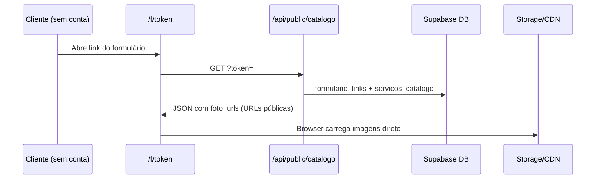

# Fotos do catálogo de serviços — opções de armazenamento

Documento de arquitetura para o Turquesa Agenda: onde guardar as imagens do catálogo (`servicos_catalogo.foto_urls`) e como clientes **não autenticados** as veem no formulário público `/f/[token]`.

## Estado atual (fase 1 — implementação em curso)

| Peça | Caminho / comportamento |
|------|-------------------------|
| Upload (owner) | `POST /api/catalogo/servicos/foto` — `requireVerifiedOwner`, multipart `file` + `servico_id` |
| Biblioteca | `lib/catalogoFotos.ts` — bucket Supabase `catalogo-fotos`, até **2 fotos × 2 MB** (JPEG/PNG/WebP) |
| Persistência | Coluna `foto_urls` (`text[]` ou JSON) em `servicos_catalogo` — URLs públicas HTTPS |
| Dashboard | `CatalogoServicosClient` — upload/delete via API acima |
| Público | `GET /api/public/catalogo?token=…` — valida `formulario_links`, devolve vitrine com `foto_urls` |
| UI pública | `app/f/[token]/page.tsx` → `CatalogoPublicoShowcase` — `<Image src={url}>` sem login do cliente |
| SQL | `npm run db:catalogo-fotos` → `servicos_catalogo_fotos_schema.sql` (bucket público + coluna) |

Fluxo do cliente no salão:

O cliente **nunca** precisa de OAuth Google nem sessão Turquesa: só o **token do link** basta para a API devolver URLs que o navegador consegue abrir sem credenciais.

---

## Opção A — Google Drive (preferida no longo prazo)

### Ideia

Armazenar cada foto na pasta do **Google Drive do dono do salão**, reutilizando a integração já existente (`getGoogleAccessToken` / `lib/googleDrive.ts` / `app/api/google-drive`). O custo de hospedagem de imagens fica na cota gratuita do Drive do usuário (15 GB conta pessoal; Workspace conforme plano).

### Upload (owner)

1. Dono conecta Google uma vez (OAuth Drive, como em Backup/Agenda).
2. `POST /api/catalogo/servicos/foto` passa a usar token do owner: criar pasta ex. `Turquesa Agenda/Catálogo/{servicoId}/`, multipart upload Drive v3.
3. Gravar em `foto_urls` uma **URL de exibição pública** (ver abaixo), não o `fileId` sozinho (ou gravar `fileId` + resolver na leitura — ver migração).

### Acesso público sem login do cliente

O formulário público continua igual: `foto_urls` deve ser lista de URLs **abertas no browser**. Duas estratégias:

| Estratégia | Como | Prós | Contras |
|------------|------|------|---------|
| **A1 — Link “qualquer pessoa com o link”** | Após upload: `permissions.create` com `type: anyone`, `role: reader`. URL típica: `https://drive.google.com/uc?export=view&id={fileId}` ou `webContentLink` de `files.get` | Simples; CDN Google; zero proxy no Vercel | Link pode ser compartilhado fora do app; política Google; latência variável; hotlinking |
| **A2 — Proxy server-side** | `GET /api/public/catalogo/imagem?token=&servico=&n=` — servidor usa refresh token do owner, `files.get` + `alt=media` | IDs do Drive não expostos; permissão do arquivo pode ser restrita | Consome quota API + CPU Vercel; latência maior; token do form vira gatekeeper |

**Recomendação Turquesa fase 2:** começar com **A1** (menor complexidade, alinhado ao modelo atual de URL direta no `<Image>`). Avaliar **A2** se houver reclamação de links públicos no Drive ou limites de quota.

### Quota e latência (Drive API)

- Upload/delete: contagem contra quota diária do projeto Google Cloud (OAuth do app).
- Visualização A1: tráfego majoritariamente nos servidores Google, não no Supabase.
- Visualização A2: cada pageview de foto = 1+ chamada API + egress Vercel — escalar com cuidado.

### Pré-requisitos

- Scope Drive já concedido no OAuth do produto.
- Pasta raiz do app (hoje `MedSupApp` em código legado) renomeável para marca Turquesa na fase de rebrand.
- Tratamento de token expirado: upload falha com mensagem “reconecte Google” (igual Backup).

---

## Opção B — Supabase Storage (fase 1 atual)

### Configuração

- Bucket **`catalogo-fotos`**, **público** para leitura (`getPublicUrl` em `lib/catalogoFotos.ts`).
- Path: `{ownerEmail}/{servicoId}/{uuid}.{ext}`.
- Limite free tier Supabase: **~1 GB** storage (verificar plano do projeto); suficiente para dezenas/centenas de salões com poucas fotos pequenas.

### Acesso público

- URL: `{NEXT_PUBLIC_SUPABASE_URL}/storage/v1/object/public/catalogo-fotos/{path}`.
- Cliente em `/f/[token]` recebe essas URLs via `/api/public/catalogo` — mesmo fluxo do diagrama acima.
- **Signed URLs** (opcional): se o bucket for privado, a API pública geraria signed URL curta ao montar a vitrine (validando `token` do form). Hoje o desenho usa bucket público para evitar expiração no cache do Next/Image.

### Prós / contras

| Prós | Contras |
|------|---------|
| Já integrado ao stack; implementação simples | 1 GB compartilhado com outros usos do projeto |
| Latência boa com CDN Supabase | Custo sobe se muitas fotos / plano pago |
| Sem depender de OAuth para **ver** foto | Custo de storage é do **SaaS**, não do salão |

---

## Opção C — Vercel Blob / Cloudflare R2 (menção)

| Serviço | Free tier (referência) | Uso no catálogo |
|---------|------------------------|-----------------|
| **Vercel Blob** | Crédito limitado no hobby; cobrança por GB armazenado + transferência | Bom se já estiver tudo na Vercel; outro provedor além de Supabase |
| **Cloudflare R2** | ~10 GB-mês storage free; egress sem taxa CF | Barato em escala; exige SDK/wiring e domínio público ou worker |

Úteis se quiser **desacoplar** fotos do Supabase DB, mas **não** eliminam custo de hosting como o Drive do usuário (opção A). Para Turquesa solo/equipe pequena, Supabase (B) ou Drive (A) costumam bastar.

---

## Opção D — Base64 / bytea no Postgres

**Rejeitada.** Até 2 × 2 MB por serviço × N serviços infla linhas, backups e RAM; JSON da API pública ficaria enorme; sem CDN. Não usar.

---

## Tabela de recomendação — Turquesa Agenda

| Critério | Fase 1 (agora) | Fase 2 (Drive) |
|----------|----------------|-----------------|
| **Quando** | Entregar catálogo com fotos já | Após estabilizar UX; dono já usa Google no produto |
| **Backend** | Supabase Storage bucket público | Drive na pasta do owner + permissão leitor anônimo (A1) |
| **Custo SaaS** | Storage Supabase (~1 GB) | Quase zero storage no Turquesa |
| **Cliente `/f/`** | `foto_urls` = URL Supabase | `foto_urls` = URL pública Drive (mesmo contrato API) |
| **Owner** | Só login Turquesa | Login Turquesa + OAuth Google |
| **Risco** | Esgotar 1 GB global | Token Google expirado; links Drive públicos |

---

## Migração Supabase → Drive (sem quebrar `/f/[token]`)

1. **Contrato estável:** `GET /api/public/catalogo` continua retornando `foto_urls: string[]` com URLs HTTPS carregáveis no browser. Componentes `CatalogoPublicoShowcase` e `CatalogoServicosClient` não precisam saber o backend.

2. **Coluna opcional (futuro):** `foto_meta jsonb[]` com `{ url, drive_file_id?, storage: 'supabase'|'drive' }` para limpeza e reprocessamento. Na fase 1 pode ser só URLs.

3. **Job de migração (por owner):**
   - Listar `servicos_catalogo` com URLs Supabase (`storagePathFromPublicUrl`).
   - Download blob → upload Drive → `permissions` anyone/reader → nova URL.
   - `UPDATE foto_urls` substituindo entrada antiga pela nova.
   - Remover objeto Supabase após sucesso.

4. **URLs antigas:** após trocar no DB, links Supabase antigos deixam de ser referenciados. Se alguém tiver cache, opcionalmente manter bucket read-only por 30 dias ou redirect 302 num proxy (baixa prioridade).

5. **Upload novo:** feature flag ou detecção “Drive conectado” → novos arquivos só no Drive; senão fallback Supabase.

6. **next.config:** `images.remotePatterns` já aceita `hostname: "**"` — URLs Drive e Supabase funcionam sem alteração.

---

## Referências no código

- `lib/catalogoFotos.ts` — limites, upload Supabase, `getCatalogoFotoPublicUrl`
- `app/api/catalogo/servicos/foto/route.ts` — POST/DELETE fotos (owner)
- `app/api/public/catalogo/route.ts` — vitrine por token do form
- `components/CatalogoPublicoShowcase.tsx` — vitrine em `/f/[token]`
- `lib/driveAuth.ts`, `lib/googleDrive.ts` — base para fase 2 Drive

---

## Decisão resumida

| Fase | Escolha |
|------|---------|
| **1 (agora)** | **Supabase Storage** — rápido, bucket público, API pública já devolve URLs |
| **2** | **Google Drive do owner** — sem custo de storage no SaaS; manter mesmo contrato `foto_urls` com URLs públicas (A1) ou proxy (A2) se necessário |

Implementação Drive: ver comentário `TODO fase 2` em `lib/catalogoFotos.ts`.
