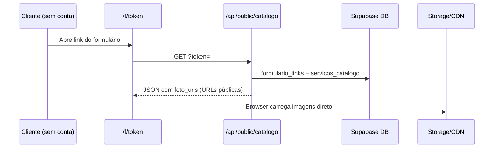

# Fotos do catálogo de serviços — opções de armazenamento

Documento de arquitetura para o Turquesa Agenda: onde guardar as imagens do catálogo (`servicos_catalogo.foto_urls`) e como clientes **não autenticados** as veem no formulário público `/f/[token]`.

## Estado atual (fase 1 — implementação em curso)

| Peça | Caminho / comportamento |
|------|-------------------------|
| Upload (owner) | `POST /api/catalogo/servicos/foto` — `requireVerifiedOwner`, multipart `file` + `servico_id` |
| Biblioteca | `lib/catalogoFotos.ts` — bucket Supabase `catalogo-fotos`, até **2 fotos × 2 MB** no envio (JPEG/PNG/WebP); **armazenamento WebP** otimizado (~150–400 KB, max 1200px, sharp) |
| Persistência | Coluna `foto_urls` (`text[]` ou JSON) em `servicos_catalogo` — URLs públicas HTTPS |
| Dashboard | `CatalogoServicosClient` — upload/delete via API acima |
| Público | `GET /api/public/catalogo?token=…` — valida `formulario_links`, devolve vitrine com `foto_urls` |
| UI pública | `app/f/[token]/page.tsx` → `CatalogoPublicoShowcase` — `<Image src={url}>` sem login do cliente |
| SQL | `npm run db:catalogo-fotos` → `servicos_catalogo_fotos_schema.sql` (bucket público + coluna) |

Fluxo do cliente no salão:



O cliente **nunca** precisa de OAuth Google nem sessão Turquesa: só o **token do link** basta para a API devolver URLs que o navegador consegue abrir sem credenciais.

---

## Opção A — Google Drive (preferida no longo prazo)

### Ideia

Armazenar cada foto na pasta do **Google Drive do dono do salão**, reutilizando a integração já existente (`getGoogleAccessToken` / `lib/googleDrive.ts` / `app/api/google-drive`). O custo de hospedagem de imagens fica na cota gratuita do Drive do usuário (15 GB conta pessoal; Workspace conforme plano).

### Upload (owner)

1. Dono conecta Google uma vez (OAuth Drive, como em Backup/Agenda).
2. `POST /api/catalogo/servicos/foto` passa a usar token do owner: criar pasta ex. `Turquesa Agenda/Catálogo/{servicoId}/`, multipart upload Drive v3.
3. Gravar em `foto_urls` uma **URL de exibição pública** (ver abaixo), não o `fileId` sozinho (ou gravar `fileId` + resolver na leitura — ver migração).

### Acesso público sem login do cliente

O formulário público continua igual: `foto_urls` deve ser lista de URLs **abertas no browser**. Duas estratégias:

| Estratégia | Como | Prós | Contras |
|------------|------|------|---------|
| **A1 — Link “qualquer pessoa com o link”** | Após upload: `permissions.create` com `type: anyone`, `role: reader`. URL típica: `https://drive.google.com/uc?export=view&id={fileId}` ou `webContentLink` de `files.get` | Simples; CDN Google; zero proxy no Vercel | Link pode ser compartilhado fora do app; política Google; latência variável; hotlinking |
| **A2 — Proxy server-side** | `GET /api/public/catalogo/imagem?token=&servico=&n=` — servidor usa refresh token do owner, `files.get` + `alt=media` | IDs do Drive não expostos; permissão do arquivo pode ser restrita | Consome quota API + CPU Vercel; latência maior; token do form vira gatekeeper |

**Recomendação Turquesa fase 2:** começar com **A1** (menor complexidade, alinhado ao modelo atual de URL direta no `<Image>`). Avaliar **A2** se houver reclamação de links públicos no Drive ou limites de quota.

### Quota e latência (Drive API)

- Upload/delete: contagem contra quota diária do projeto Google Cloud (OAuth do app).
- Visualização A1: tráfego majoritariamente nos servidores Google, não no Supabase.
- Visualização A2: cada pageview de foto = 1+ chamada API + egress Vercel — escalar com cuidado.

### Pré-requisitos

- Scope Drive já concedido no OAuth do produto.
- Pasta raiz do app (hoje `MedSupApp` em código legado) renomeável para marca Turquesa na fase de rebrand.
- Tratamento de token expirado: upload falha com mensagem “reconecte Google” (igual Backup).

---

## Opção B — Supabase Storage (fase 1 atual)

### Configuração

- Bucket **`catalogo-fotos`**, **público** para leitura (`getPublicUrl` em `lib/catalogoFotos.ts`).
- Path: `{ownerEmail}/{servicoId}/{uuid}.webp` (sempre WebP após compressão no upload).
- Limite free tier Supabase: **~1 GB** storage (verificar plano do projeto); suficiente para dezenas/centenas de salões com poucas fotos pequenas.

### Acesso público

- URL: `{NEXT_PUBLIC_SUPABASE_URL}/storage/v1/object/public/catalogo-fotos/{path}`.
- Cliente em `/f/[token]` recebe essas URLs via `/api/public/catalogo` — mesmo fluxo do diagrama acima.
- **Signed URLs** (opcional): se o bucket for privado, a API pública geraria signed URL curta ao montar a vitrine (validando `token` do form). Hoje o desenho usa bucket público para evitar expiração no cache do Next/Image.

### Prós / contras

| Prós | Contras |
|------|---------|
| Já integrado ao stack; implementação simples | 1 GB compartilhado com outros usos do projeto |
| Latência boa com CDN Supabase | Custo sobe se muitas fotos / plano pago |
| Sem depender de OAuth para **ver** foto | Custo de storage é do **SaaS**, não do salão |

---

## Opção C — Vercel Blob / Cloudflare R2 (menção)

| Serviço | Free tier (referência) | Uso no catálogo |
|---------|------------------------|-----------------|
| **Vercel Blob** | Crédito limitado no hobby; cobrança por GB armazenado + transferência | Bom se já estiver tudo na Vercel; outro provedor além de Supabase |
| **Cloudflare R2** | ~10 GB-mês storage free; egress sem taxa CF | Barato em escala; exige SDK/wiring e domínio público ou worker |

Úteis se quiser **desacoplar** fotos do Supabase DB, mas **não** eliminam custo de hosting como o Drive do usuário (opção A). Para Turquesa solo/equipe pequena, Supabase (B) ou Drive (A) costumam bastar.

---

## Opção D — Base64 / bytea no Postgres

**Rejeitada.** Até 2 × 2 MB por serviço × N serviços infla linhas, backups e RAM; JSON da API pública ficaria enorme; sem CDN. Não usar.

---

## Tabela de recomendação — Turquesa Agenda

| Critério | Fase 1 (agora) | Fase 2 (Drive) |
|----------|----------------|-----------------|
| **Quando** | Entregar catálogo com fotos já | Após estabilizar UX; dono já usa Google no produto |
| **Backend** | Supabase Storage bucket público | Drive na pasta do owner + permissão leitor anônimo (A1) |
| **Custo SaaS** | Storage Supabase (~1 GB) | Quase zero storage no Turquesa |
| **Cliente `/f/`** | `foto_urls` = URL Supabase | `foto_urls` = URL pública Drive (mesmo contrato API) |
| **Owner** | Só login Turquesa | Login Turquesa + OAuth Google |
| **Risco** | Esgotar 1 GB global | Token Google expirado; links Drive públicos |

---

## Migração Supabase → Drive (sem quebrar `/f/[token]`)

1. **Contrato estável:** `GET /api/public/catalogo` continua retornando `foto_urls: string[]` com URLs HTTPS carregáveis no browser. Componentes `CatalogoPublicoShowcase` e `CatalogoServicosClient` não precisam saber o backend.

2. **Coluna opcional (futuro):** `foto_meta jsonb[]` com `{ url, drive_file_id?, storage: 'supabase'|'drive' }` para limpeza e reprocessamento. Na fase 1 pode ser só URLs.

3. **Job de migração (por owner):**
   - Listar `servicos_catalogo` com URLs Supabase (`storagePathFromPublicUrl`).
   - Download blob → upload Drive → `permissions` anyone/reader → nova URL.
   - `UPDATE foto_urls` substituindo entrada antiga pela nova.
   - Remover objeto Supabase após sucesso.

4. **URLs antigas:** após trocar no DB, links Supabase antigos deixam de ser referenciados. Se alguém tiver cache, opcionalmente manter bucket read-only por 30 dias ou redirect 302 num proxy (baixa prioridade).

5. **Upload novo:** feature flag ou detecção “Drive conectado” → novos arquivos só no Drive; senão fallback Supabase.

6. **next.config:** `images.remotePatterns` já aceita `hostname: "**"` — URLs Drive e Supabase funcionam sem alteração.

---

## Escala e custos

Estimativas para planejar crescimento do catálogo com fotos. Premissas atuais do produto: **até 2 fotos × 2 MB** por serviço (`lib/catalogoFotos.ts`).

### Fórmula de storage (pior caso)

```
GB ≈ salões × serviços_por_salão × 2 fotos × 2 MB ÷ 1024
```

| Cenário | Cálculo | Storage (pior caso) | Nota |
|---------|---------|---------------------|------|
| **100 salões × 10 serviços** | 100 × 10 × 2 × 2 MB | **~4 GB** | Todos os serviços com 2 fotos no tamanho máximo |
| **500 salões × 20 serviços** | 500 × 20 × 2 × 2 MB | **~40 GB** | Escala “produto deu certo” |
| **1 000 salões × 20 serviços** | 1 000 × 20 × 2 × 2 MB | **~80 GB** | Ainda cabe no Pro Supabase (100 GB incl.) |

**Uso realista** (nem todo serviço tem foto; média ~500 KB/foto em vez de 2 MB): dividir os valores acima por **~4–8**. Ex.: 100 salões × 10 serviços ≈ **0,5–1 GB**, não 4 GB.

**Com compressão WebP no upload (implementado):** entrada até 2 MB; armazenado ~150–400 KB (média ~220–280 KB). Dividir pior caso por **~10**. Ex.: 500 salões × 20 serviços ≈ **~4 GB** em vez de 40 GB — reduz storage e egress de forma relevante.

### Supabase Storage — free vs Pro

| Plano | Storage incluído | Egress incluído | Overage storage | Overage egress (CDN) |
|-------|------------------|-----------------|-----------------|----------------------|
| **Free** | **1 GB** (projeto inteiro, compartilhado com DB/backups) | 5 GB | Não escala — limite rígido | Idem |
| **Pro (~US$ 25/mês)** | **100 GB** | 250 GB (+ 250 GB cached egress) | **US$ 0,0213/GB/mês** | US$ 0,09/GB (US$ 0,03 cached) |

Implicações para o Turquesa (fase 1, bucket único `catalogo-fotos`):

- **Free 1 GB:** aguenta dezenas de salões em uso realista; **estoura** se ~25+ salões preencherem catálogo completo no pior caso (4 GB só nos primeiros 100 salões).
- **Pro 100 GB:** cobre confortavelmente até **~500 salões × 20 serviços** no pior caso (~40 GB) com margem; acima disso, overage barato (~US$ 0,85/mês por +40 GB) ou migrar para Drive.
- O bucket compartilha cota com **outros** usos do projeto (se houver); monitorar dashboard Supabase → Storage.

**Gatilho sugerido para upgrade Pro:** storage do projeto > **700 MB** ou > **50 salões ativos** com catálogo/fotos.

**Gatilho sugerido para fase 2 (Drive default):** storage catálogo > **~30 GB** ou > **~200 salões** — aí o custo/ risco passa a valer migrar novos uploads para Drive do owner.

### Google Drive — storage por salão (fase 2)

| Aspecto | Impacto |
|---------|---------|
| **Custo storage SaaS** | **~zero** — blobs ficam na conta Google do dono (15 GB grátis pessoal; Workspace conforme plano) |
| **Custo Turquesa** | Quota **Drive API** do projeto OAuth (upload/delete/list); não GB armazenados |
| **Multi-tenant** | Pasta por owner: `Turquesa Agenda/Catálogo/{servicoId}/` — isolamento natural, sem bucket compartilhado |
| **Riscos** | Token expirado; links públicos (A1); limites diários API se muitos uploads simultâneos |

Para **500 salões × 20 serviços × 2 fotos** = 20 000 arquivos no Drive **dos clientes**, não no Turquesa. O SaaS paga essencialmente chamadas de API, não hosting de imagem.

Quota Drive API (referência): ordem de **milhares de requests/dia** por projeto Google Cloud — suficiente para uploads esporádicos; monitorar se virar upload em massa ou proxy A2 (cada pageview = API call).

### Bandwidth — vitrine pública `/f/[token]`

Fluxo atual: HTML/JSON saem da **Vercel**; **imagens** saem direto do **Storage/CDN** (Supabase ou Google), não passam pelo servidor Next.

| Origem | Quem paga egress | Escala |
|--------|------------------|--------|
| **Supabase bucket público** | Cota egress do **projeto Supabase** (5 GB free / 250 GB Pro) | N pageviews × M fotos × tamanho médio |
| **Drive A1 (URL direta)** | Infra Google; Turquesa quase zero | Hotlinking possível; cache do browser ajuda |
| **Vercel** | Só API JSON + página — negligible vs fotos | `next/image` otimiza se configurado; URLs externas vão ao CDN de origem |

**Exemplo egress (Supabase):** 1 000 visualizações/dia de um form com 10 serviços × 2 fotos × 500 KB ≈ **~10 GB/dia** se todo mundo carregar tudo — **~300 GB/mês**, acima do Pro (250 GB). Mitigações:

- Compressão WebP ~200 KB no upload (÷2,5 vs 500 KB).
- Lazy load / poucas fotos above-the-fold em `CatalogoPublicoShowcase`.
- Drive A1 ou CDN com cached egress mais barato após escala.
- `sizes` corretos no `<Image>` para não baixar resolução desnecessária.

### Multi-tenant: um bucket vs pasta Drive por owner

| Modelo | Path / isolamento | Prós | Contras |
|--------|-------------------|------|---------|
| **Supabase (fase 1)** | `{ownerEmail}/{servicoId}/{uuid}.ext` no bucket **`catalogo-fotos`** | Simples; URLs públicas uniformes; um lugar para backup/monitorar | Cota **global** do SaaS; todos os tenants no mesmo bucket |
| **Drive (fase 2)** | Pasta **`Turquesa Agenda/Catálogo/`** na conta Google de cada owner | Storage **descentralizado**; escala sem linear cost no Turquesa | Depende OAuth; migração; URLs menos uniformes |

Recomendação: manter **contrato** `foto_urls: string[]` igual nos dois modelos; opcional `foto_meta.storage` para saber origem na migração/limpeza.

### Roadmap por fase

| Fase | Quando | Backend | Ações de escala |
|------|--------|---------|-----------------|
| **1a** | Lançamento – ~50 salões | Supabase Free | Bucket público atual; alerta manual se storage > 700 MB |
| **1b** | ~50–200 salões | Supabase Pro | Monitorar storage + egress; resize WebP no upload **já ativo** |
| **2** | >200 salões ou >30 GB catálogo | **Drive default** (novos uploads) | Owner conectado → Drive; fallback Supabase; job migração por tenant |
| **2+** | Egress alto em `/f/` | Drive A1 + otimização UI | Lazy load; WebP; evitar proxy A2 salvo necessidade |

### Compressão WebP no upload (implementado)

- **Dependência:** `sharp` em `lib/catalogoFotosStorage.ts` (`compressCatalogoFotoForStorage`).
- **Fluxo:** validação do arquivo original (até 2 MB, JPEG/PNG/WebP) → resize lado máximo **1200 px** → WebP quality **82** → upload `.webp` no bucket `catalogo-fotos`.
- **Tamanhos típicos:** entrada ~600–1800 KB; saída ~150–400 KB (média ~220–280 KB).
- **UI:** hint no dashboard — *Até 2 MB no envio; salvamos otimizado em WebP*.
- **Público `/f/[token]`:** inalterado (`foto_urls` HTTPS); `next.config` já aceita `image/webp` e `remotePatterns` `**`.

### Limites práticos no produto (documentar / UI)

Limites **já implementados:**

| Limite | Valor | Onde |
|--------|-------|------|
| Fotos por serviço | 2 | `CATALOGO_FOTO_MAX_COUNT` |
| Tamanho no envio | 2 MB | `CATALOGO_FOTO_MAX_BYTES` |
| Formatos no envio | JPEG, PNG, WebP | `CATALOGO_FOTO_MIME_TYPES` |
| Armazenamento | WebP otimizado (~150–400 KB) | `compressCatalogoFotoForStorage` |

**Soft caps sugeridos** (não bloqueiam hoje; orientam suporte e evitam abuso):

| Limite | Valor sugerido | Motivo |
|--------|----------------|------|
| Serviços no catálogo por salão | **~50** soft cap (aviso UI); **100** hard cap futuro | Salão típico 10–30 serviços; 100 × 2 × 2 MB = 400 MB/salão no pior caso |
| Storage total por owner (fase 1 Supabase) | Aviso se **> 20 MB** de fotos | Early signal antes de estourar cota global |
| Upload em lote | Sem bulk upload na v1 | Protege quota API (fase 2) e UX |

Com **50 serviços × 2 fotos × 2 MB** = **~200 MB/salão** no pior caso → **~5 salões “cheios”** estouram 1 GB free; **~500 salões “cheios”** ≈ 100 GB Pro. Na prática, com média realista (~25 MB/salão), **1 GB free ≈ 40 salões** e **100 GB Pro ≈ 4 000 salões** — o gargalo real tende a ser **egress da vitrine pública**, não storage.

---

## Referências no código

- `lib/catalogoFotos.ts` — limites, URLs, validação (cliente + API)
- `lib/catalogoFotosStorage.ts` — compressão WebP (sharp) e upload Supabase
- `app/api/catalogo/servicos/foto/route.ts` — POST/DELETE fotos (owner)
- `app/api/public/catalogo/route.ts` — vitrine por token do form
- `components/CatalogoPublicoShowcase.tsx` — vitrine em `/f/[token]`
- `lib/driveAuth.ts`, `lib/googleDrive.ts` — base para fase 2 Drive

---

## Decisão resumida

| Fase | Escolha |
|------|---------|
| **1 (agora)** | **Supabase Storage** — rápido, bucket público, API pública já devolve URLs |
| **2** | **Google Drive do owner** — sem custo de storage no SaaS; manter mesmo contrato `foto_urls` com URLs públicas (A1) ou proxy (A2) se necessário |

Implementação Drive: ver comentário `TODO fase 2` em `lib/catalogoFotos.ts`.
